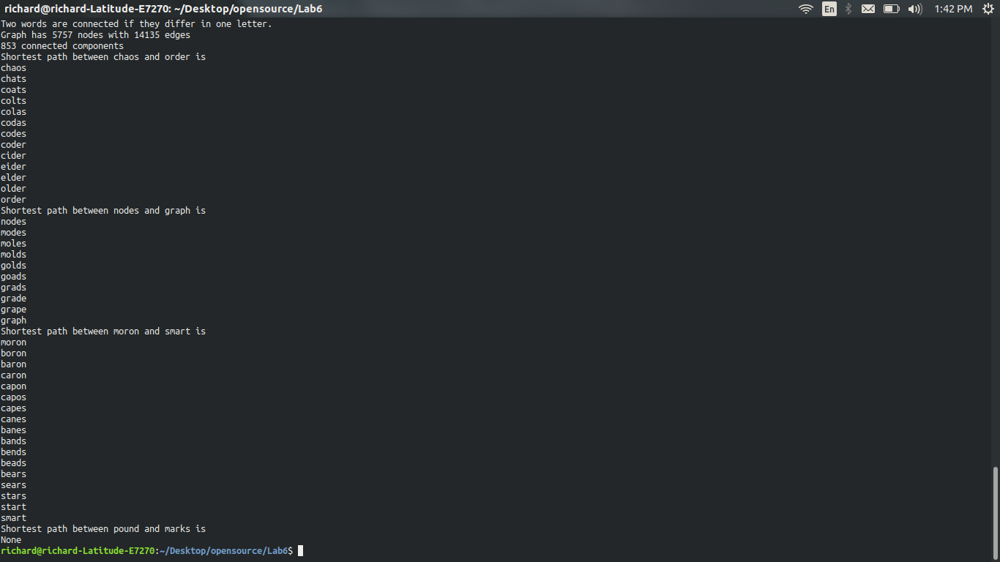
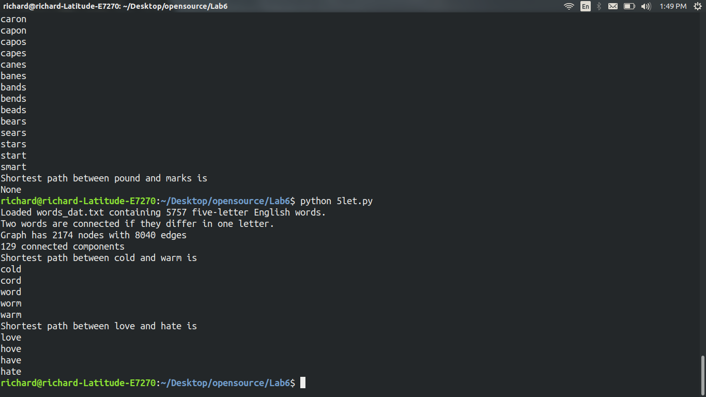
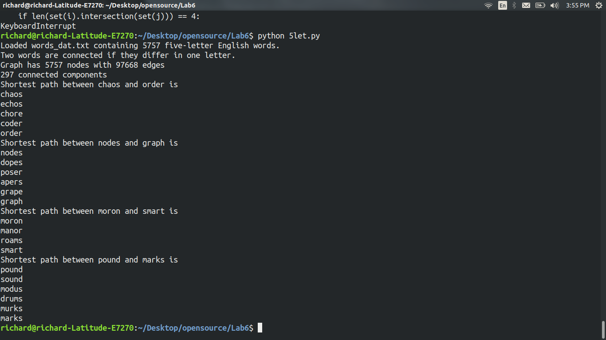

# Your results for the 4 five letter pairs  

  

# Code for 4 letter solution

File called 4letters.py in this repo  

# Results for two letter pairs

  

# Code for unordered solution

File called 5let.py in this repo

# Results for the four 5 letter unordered pairs  

  

